# FolioNote 数据库设计指南

本文档帮助你理解 FolioNote 项目的数据库设计，同时学习关系型数据库的核心概念。

## 目录

1. [数据库基础概念](#1-数据库基础概念)
2. [ER 图：整体架构](#2-er-图整体架构)
3. [表关系详解](#3-表关系详解)
4. [Drizzle ORM 入门](#4-drizzle-orm-入门)
5. [索引与性能](#5-索引与性能)
6. [软删除模式](#6-软删除模式)
7. [常见查询模式](#7-常见查询模式)
8. [进阶：事务（Transaction）](#8-进阶事务transaction)
9. [进阶：迁移（Migration）](#9-进阶迁移migration)
10. [进阶：连接池（Connection Pool）](#10-进阶连接池connection-pool)

---

## 1. 数据库基础概念

### 什么是关系型数据库？

关系型数据库将数据组织成**表（Table）**，表之间通过**关系（Relationship）**连接。

```mermaid
mindmap
  root((关系型数据库))
    表 Table
      行 Row = 一条记录
      列 Column = 一个字段
      主键 Primary Key
      外键 Foreign Key
    关系 Relationship
      一对一 1:1
      一对多 1:N
      多对多 M:N
    约束 Constraint
      NOT NULL
      UNIQUE
      DEFAULT
      REFERENCES
```

### 核心术语速查

| 术语 | 英文 | 解释 | 例子 |
|------|------|------|------|
| 主键 | Primary Key | 唯一标识一条记录 | `id: "abc123"` |
| 外键 | Foreign Key | 引用另一个表的主键 | `userId` 引用 `user.id` |
| 索引 | Index | 加速查询的数据结构 | 类似书的目录 |
| 关系 | Relation | 表与表之间的连接 | user → entries |
| 约束 | Constraint | 数据的规则限制 | `NOT NULL`、`UNIQUE` |

---

## 2. ER 图：整体架构

### 完整实体关系图


### 表分组概览

```mermaid
flowchart TB
    subgraph Auth["🔐 认证层 (Better Auth)"]
        USER[user]
        SESSION[session]
        ACCOUNT[account]
        VERIFICATION[verification]
    end

    subgraph Core["📝 核心业务"]
        ENTRIES[entries<br/>学习笔记]
        TAGS[tags<br/>标签]
        SOURCES[sources<br/>来源]
    end

    subgraph Relations["🔗 关联表"]
        ENTRY_TAGS[entry_tags]
        ENTRY_SOURCES[entry_sources]
    end

    subgraph Support["📎 辅助功能"]
        ATTACHMENTS[attachments<br/>附件]
        REVIEW_EVENTS[review_events<br/>复习记录]
        DAILY_LOGS[daily_logs<br/>每日日志]
    end

    USER --> Core
    Core --> Relations
    ENTRIES --> Support
```

---

## 3. 表关系详解

### 3.1 一对多关系 (1:N)

**概念**：一个用户可以有多个笔记，但每个笔记只属于一个用户。

```mermaid
flowchart LR
    subgraph User["👤 User"]
        U1[id: user_1]
    end

    subgraph Entries["📝 Entries"]
        E1[id: entry_1<br/>user_id: user_1]
        E2[id: entry_2<br/>user_id: user_1]
        E3[id: entry_3<br/>user_id: user_1]
    end

    U1 -->|1:N| E1
    U1 -->|1:N| E2
    U1 -->|1:N| E3
```

**Drizzle 代码解析**：

```typescript
// entries 表中定义外键
userId: text('user_id')
  .notNull()
  .references(() => user.id, { onDelete: 'cascade' })
//            ↑ 引用 user 表的 id
//                              ↑ 删除用户时，级联删除所有笔记
```

### 3.2 多对多关系 (M:N)

**概念**：一个笔记可以有多个标签，一个标签也可以被多个笔记使用。

```mermaid
flowchart TB
    subgraph Entries["📝 Entries"]
        E1[React 学习笔记]
        E2[TypeScript 入门]
    end

    subgraph JoinTable["🔗 entry_tags (中间表)"]
        ET1[entry_id: E1<br/>tag_id: T1]
        ET2[entry_id: E1<br/>tag_id: T2]
        ET3[entry_id: E2<br/>tag_id: T2]
        ET4[entry_id: E2<br/>tag_id: T3]
    end

    subgraph Tags["🏷️ Tags"]
        T1[前端]
        T2[JavaScript]
        T3[编程语言]
    end

    E1 --- ET1
    E1 --- ET2
    E2 --- ET3
    E2 --- ET4

    ET1 --- T1
    ET2 --- T2
    ET3 --- T2
    ET4 --- T3
```

**为什么需要中间表？**

```mermaid
flowchart LR
    subgraph Wrong["❌ 错误做法"]
        direction TB
        W1["entries 表中存 tags: ['前端', 'JS']"]
        W2["问题: 无法查询、无法统计、数据冗余"]
    end

    subgraph Right["✅ 正确做法"]
        direction TB
        R1["使用 entry_tags 中间表"]
        R2["可查询: 找出所有'前端'标签的笔记"]
        R3["可统计: 每个标签有多少笔记"]
    end

    Wrong -.->|改进| Right
```

### 3.3 可选的一对多关系

**概念**：附件可以不属于任何笔记（孤立附件），也可以关联到一个笔记。

```mermaid
flowchart LR
    subgraph Attachments["📎 Attachments"]
        A1[图片1.jpg<br/>entry_id: entry_1]
        A2[图片2.jpg<br/>entry_id: null ❓]
        A3[文档.pdf<br/>entry_id: entry_1]
    end

    subgraph Entry["📝 Entry"]
        E1[entry_1]
    end

    A1 -->|belongs to| E1
    A3 -->|belongs to| E1
    A2 -.->|orphan| NONE[无关联]
```

**代码实现**：

```typescript
// 外键可以为 null，且删除笔记时设为 null 而不是删除附件
entryId: text('entry_id')
  .references(() => entries.id, { onDelete: 'set null' })
//                                ↑ 删除笔记时，附件的 entry_id 设为 null
```

---

## 4. Drizzle ORM 入门

### 什么是 ORM？

```mermaid
flowchart LR
    subgraph App["🖥️ 应用代码"]
        TS["TypeScript 对象"]
    end

    subgraph ORM["🔄 Drizzle ORM"]
        TRANSLATE["翻译层"]
    end

    subgraph DB["🗄️ PostgreSQL"]
        SQL["SQL 语句"]
    end

    TS -->|"db.select()"| TRANSLATE
    TRANSLATE -->|"SELECT * FROM..."| SQL
    SQL -->|"返回数据"| TRANSLATE
    TRANSLATE -->|"类型安全的对象"| TS
```

### Drizzle 表定义语法

```typescript
// 定义表结构
export const entries = pgTable(
  'entries',        // 表名
  {
    // 列定义
    id: text('id').primaryKey(),                    // 主键
    userId: text('user_id').notNull(),              // 非空
    title: text('title').notNull().default(''),     // 带默认值
    isInbox: boolean('is_inbox').default(true),     // 布尔类型
    createdAt: timestamp('created_at').defaultNow(),// 时间戳
  },
  // 索引定义
  (table) => [
    index('entries_user_id_idx').on(table.userId),
  ]
)
```

### 常用字段类型对照

```mermaid
flowchart LR
    subgraph Drizzle["Drizzle 类型"]
        D1["text()"]
        D2["boolean()"]
        D3["timestamp()"]
        D4["integer()"]
    end

    subgraph PostgreSQL["PostgreSQL 类型"]
        P1["TEXT / VARCHAR"]
        P2["BOOLEAN"]
        P3["TIMESTAMP"]
        P4["INTEGER"]
    end

    subgraph TypeScript["TypeScript 类型"]
        T1["string"]
        T2["boolean"]
        T3["Date"]
        T4["number"]
    end

    D1 --> P1 --> T1
    D2 --> P2 --> T2
    D3 --> P3 --> T3
    D4 --> P4 --> T4
```

### 关系定义

```typescript
// 定义 entries 表的关系
export const entriesRelations = relations(entries, ({ one, many }) => ({
  // 一对一：每个 entry 属于一个 user
  user: one(user, {
    fields: [entries.userId],    // entries 表的外键字段
    references: [user.id],       // user 表的主键字段
  }),
  // 一对多：每个 entry 可以有多个 entryTags
  entryTags: many(entryTags),
  attachments: many(attachments),
}))
```

---

## 5. 索引与性能

### 什么是索引？

```mermaid
flowchart TB
    subgraph NoIndex["❌ 没有索引"]
        NI1["查询: WHERE user_id = 'abc'"]
        NI2["数据库: 扫描全部 10000 条记录"]
        NI3["耗时: 100ms"]
    end

    subgraph WithIndex["✅ 有索引"]
        WI1["查询: WHERE user_id = 'abc'"]
        WI2["数据库: 通过索引直接定位"]
        WI3["耗时: 1ms"]
    end

    NoIndex -.->|添加索引| WithIndex
```

### 索引类型图解

```mermaid
flowchart TB
    subgraph Single["单列索引"]
        S1["index('idx').on(table.userId)"]
        S2["适用: WHERE user_id = ?"]
    end

    subgraph Composite["复合索引"]
        C1["index('idx').on(table.userId, table.updatedAt)"]
        C2["适用: WHERE user_id = ? AND updated_at > ?"]
        C3["⚠️ 列顺序很重要！"]
    end

    subgraph Unique["唯一索引"]
        U1[".unique()"]
        U2["确保列值唯一，如 email"]
    end
```

### FolioNote 项目的索引策略

```mermaid
flowchart LR
    subgraph Query["常见查询"]
        Q1["获取用户的所有笔记"]
        Q2["获取用户最近更新的笔记"]
        Q3["获取用户的收藏笔记"]
        Q4["获取未删除的笔记"]
    end

    subgraph Index["对应索引"]
        I1["entries_user_id_updated_at_idx"]
        I2["entries_user_id_is_starred_idx"]
        I3["entries_user_id_deleted_at_idx"]
    end

    Q1 --> I1
    Q2 --> I1
    Q3 --> I2
    Q4 --> I3
```

---

## 6. 软删除模式

### 硬删除 vs 软删除

```mermaid
flowchart TB
    subgraph Hard["❌ 硬删除"]
        H1["DELETE FROM entries WHERE id = 'abc'"]
        H2["数据永久消失"]
        H3["无法恢复、无法审计"]
    end

    subgraph Soft["✅ 软删除"]
        S1["UPDATE entries SET deleted_at = NOW()"]
        S2["数据仍在数据库中"]
        S3["可恢复、可审计、可统计"]
    end

    Hard -.->|更好的方案| Soft
```

### 软删除的数据生命周期

```mermaid
stateDiagram-v2
    [*] --> Active: 创建记录
    Active --> Deleted: 软删除<br/>deleted_at = NOW()
    Deleted --> Active: 恢复<br/>deleted_at = NULL
    Deleted --> [*]: 定期清理<br/>(可选的硬删除)

    note right of Active
        deleted_at = NULL
        正常显示和查询
    end note

    note right of Deleted
        deleted_at = 时间戳
        默认查询中隐藏
    end note
```

### 软删除查询模式

```typescript
// 只查询未删除的记录（默认行为）
const activeEntries = await db.query.entries.findMany({
  where: isNull(entries.deletedAt)
})

// 只查询已删除的记录（回收站功能）
const trashedEntries = await db.query.entries.findMany({
  where: isNotNull(entries.deletedAt)
})

// 恢复记录
await db.update(entries)
  .set({ deletedAt: null })
  .where(eq(entries.id, entryId))
```

---

## 7. 常见查询模式

### 7.1 基础 CRUD 操作

```mermaid
flowchart LR
    subgraph CRUD["CRUD 操作"]
        C["Create<br/>创建"]
        R["Read<br/>读取"]
        U["Update<br/>更新"]
        D["Delete<br/>删除"]
    end

    subgraph Drizzle["Drizzle 方法"]
        DC["db.insert()"]
        DR["db.select()<br/>db.query"]
        DU["db.update()"]
        DD["db.delete()"]
    end

    C --> DC
    R --> DR
    U --> DU
    D --> DD
```

### 7.2 关联查询示例

```mermaid
flowchart TB
    subgraph Query["查询需求"]
        Q1["获取笔记及其所有标签"]
    end

    subgraph Flow["查询流程"]
        F1["1. 查询 entries 表"]
        F2["2. 通过 entry_tags 中间表"]
        F3["3. 关联 tags 表"]
        F4["4. 返回完整数据"]
    end

    subgraph Result["返回结果"]
        R1["{ entry, tags: [...] }"]
    end

    Query --> F1 --> F2 --> F3 --> F4 --> Result
```

```typescript
// Drizzle 关联查询
const entryWithTags = await db.query.entries.findFirst({
  where: eq(entries.id, entryId),
  with: {
    entryTags: {
      with: {
        tag: true  // 包含完整的 tag 信息
      }
    }
  }
})

// 结果结构
// {
//   id: "entry_1",
//   title: "React 学习笔记",
//   entryTags: [
//     { tag: { id: "tag_1", name: "前端" } },
//     { tag: { id: "tag_2", name: "JavaScript" } }
//   ]
// }
```

### 7.3 过滤和分页

```mermaid
flowchart TB
    subgraph Filters["过滤条件"]
        F1["用户 ID"]
        F2["是否在 Inbox"]
        F3["是否已删除"]
        F4["时间范围"]
    end

    subgraph Pagination["分页参数"]
        P1["limit: 每页数量"]
        P2["offset: 跳过数量"]
        P3["orderBy: 排序字段"]
    end

    subgraph Result["查询结果"]
        R1["第 N 页的数据"]
    end

    Filters --> Result
    Pagination --> Result
```

```typescript
// 分页查询用户的笔记
const page = 1
const pageSize = 20

const entries = await db.query.entries.findMany({
  where: and(
    eq(entries.userId, userId),
    eq(entries.isInbox, false),
    isNull(entries.deletedAt)
  ),
  orderBy: desc(entries.updatedAt),
  limit: pageSize,
  offset: (page - 1) * pageSize,
})
```

---

## 附录：快速参考

### Drizzle 常用方法

| 方法 | 用途 | 示例 |
|------|------|------|
| `eq()` | 等于 | `eq(entries.userId, 'abc')` |
| `ne()` | 不等于 | `ne(entries.isInbox, true)` |
| `gt()` / `gte()` | 大于 / 大于等于 | `gt(entries.createdAt, date)` |
| `lt()` / `lte()` | 小于 / 小于等于 | `lt(entries.createdAt, date)` |
| `and()` | 与 | `and(cond1, cond2)` |
| `or()` | 或 | `or(cond1, cond2)` |
| `isNull()` | 为空 | `isNull(entries.deletedAt)` |
| `isNotNull()` | 不为空 | `isNotNull(entries.deletedAt)` |
| `like()` | 模糊匹配 | `like(entries.title, '%React%')` |

### 外键删除行为

| 行为 | 说明 | 使用场景 |
|------|------|----------|
| `cascade` | 级联删除 | 删除用户时删除其所有笔记 |
| `set null` | 设为 NULL | 删除笔记时保留附件 |
| `restrict` | 阻止删除 | 有关联数据时禁止删除 |
| `no action` | 默认，同 restrict | - |

---

## 8. 进阶：事务（Transaction）

### 什么是事务？

事务是一组操作的集合，要么全部成功，要么全部失败。这保证了数据的一致性。

```mermaid
flowchart TB
    subgraph Transaction["🔄 事务"]
        direction TB
        T1["操作 1: 创建笔记"]
        T2["操作 2: 创建标签关联"]
        T3["操作 3: 更新统计"]
    end

    subgraph Success["✅ 全部成功"]
        S1["所有操作生效"]
        S2["数据一致"]
    end

    subgraph Failure["❌ 任一失败"]
        F1["所有操作回滚"]
        F2["回到事务前状态"]
    end

    Transaction -->|commit| Success
    Transaction -->|rollback| Failure
```

### ACID 特性

```mermaid
mindmap
  root((ACID))
    A - Atomicity
      原子性
      全部成功或全部失败
      不存在部分成功
    C - Consistency
      一致性
      数据始终有效
      满足所有约束
    I - Isolation
      隔离性
      事务之间互不干扰
      并发安全
    D - Durability
      持久性
      提交后永久保存
      即使系统崩溃
```

### 事务使用场景

```mermaid
flowchart LR
    subgraph Scenarios["常见场景"]
        S1["转账操作"]
        S2["订单创建"]
        S3["批量更新"]
        S4["关联数据创建"]
    end

    subgraph Example["FolioNote 场景"]
        E1["创建笔记 + 标签 + 来源"]
        E2["删除用户所有数据"]
        E3["批量移动笔记"]
    end

    Scenarios --> Example
```

### Drizzle 事务代码

```typescript
import { db } from '@folio/db'

// 创建笔记并关联标签的事务
async function createEntryWithTags(
  userId: string,
  title: string,
  tagIds: string[]
) {
  return await db.transaction(async (tx) => {
    // 1. 创建笔记
    const [entry] = await tx.insert(entries).values({
      id: generateId(),
      userId,
      title,
    }).returning()

    // 2. 创建标签关联
    if (tagIds.length > 0) {
      await tx.insert(entryTags).values(
        tagIds.map(tagId => ({
          id: generateId(),
          entryId: entry.id,
          tagId,
        }))
      )
    }

    // 如果任何步骤失败，整个事务回滚
    return entry
  })
}
```

### 事务隔离级别

```mermaid
flowchart TB
    subgraph Levels["隔离级别（从低到高）"]
        L1["Read Uncommitted<br/>读未提交"]
        L2["Read Committed<br/>读已提交 ⭐ PostgreSQL 默认"]
        L3["Repeatable Read<br/>可重复读"]
        L4["Serializable<br/>串行化"]
    end

    subgraph Tradeoff["权衡"]
        T1["隔离性 ↑"]
        T2["性能 ↓"]
    end

    L1 --> L2 --> L3 --> L4
    L4 --> T1
    L1 --> T2
```

```typescript
// 指定隔离级别
await db.transaction(async (tx) => {
  // 事务操作
}, {
  isolationLevel: 'serializable'  // 最高隔离级别
})
```

---

## 9. 进阶：迁移（Migration）

### 什么是迁移？

迁移是数据库 Schema 变更的版本控制，让你能够安全地演进数据库结构。

```mermaid
flowchart LR
    subgraph Timeline["时间线"]
        V1["v1: 初始表"]
        V2["v2: 添加字段"]
        V3["v3: 添加索引"]
        V4["v4: 新建表"]
    end

    subgraph Migration["迁移文件"]
        M1["0001_init.sql"]
        M2["0002_add_field.sql"]
        M3["0003_add_index.sql"]
        M4["0004_new_table.sql"]
    end

    V1 --> V2 --> V3 --> V4
    M1 --> M2 --> M3 --> M4
```

### Push vs Migration 对比

```mermaid
flowchart TB
    subgraph Push["db:push（开发环境）"]
        P1["直接同步 Schema"]
        P2["快速迭代"]
        P3["⚠️ 可能丢失数据"]
        P4["不生成 SQL 文件"]
    end

    subgraph Migration["db:migrate（生产环境）"]
        M1["生成 SQL 迁移文件"]
        M2["可追溯、可回滚"]
        M3["✅ 数据安全"]
        M4["版本控制"]
    end

    Push -->|"适用于"| DEV["开发环境"]
    Migration -->|"适用于"| PROD["生产环境"]
```

### 迁移工作流程

```mermaid
sequenceDiagram
    participant Dev as 开发者
    participant Code as Schema 代码
    participant CLI as Drizzle CLI
    participant DB as 数据库

    Dev->>Code: 1. 修改 schema/*.ts
    Dev->>CLI: 2. bun run db:generate
    CLI->>CLI: 3. 生成 SQL 迁移文件
    Dev->>Dev: 4. Review SQL 文件
    Dev->>CLI: 5. bun run db:migrate
    CLI->>DB: 6. 执行迁移
    DB->>DB: 7. 记录迁移历史
```

### 迁移文件示例

```sql
-- 0001_create_entries.sql
CREATE TABLE IF NOT EXISTS "entries" (
  "id" text PRIMARY KEY NOT NULL,
  "user_id" text NOT NULL,
  "title" text DEFAULT '' NOT NULL,
  "content" text DEFAULT '' NOT NULL,
  "is_inbox" boolean DEFAULT true NOT NULL,
  "created_at" timestamp DEFAULT now() NOT NULL,
  "updated_at" timestamp DEFAULT now() NOT NULL,
  "deleted_at" timestamp
);

CREATE INDEX IF NOT EXISTS "entries_user_id_updated_at_idx"
  ON "entries" ("user_id", "updated_at");

ALTER TABLE "entries"
  ADD CONSTRAINT "entries_user_id_user_id_fk"
  FOREIGN KEY ("user_id") REFERENCES "user"("id")
  ON DELETE CASCADE;
```

### FolioNote 迁移命令

```bash
# 开发环境：直接推送 schema 变更
bun run db:push

# 生产环境：生成迁移文件
bun run db:generate

# 应用迁移
bun run db:migrate

# 查看数据库（可视化工具）
bun run db:studio
```

### 迁移最佳实践

```mermaid
flowchart TB
    subgraph Best["✅ 最佳实践"]
        B1["每个功能一个迁移"]
        B2["迁移文件提交到 Git"]
        B3["生产前先在测试环境验证"]
        B4["破坏性变更加注释"]
    end

    subgraph Avoid["❌ 避免"]
        A1["修改已提交的迁移"]
        A2["生产环境用 db:push"]
        A3["大量数据迁移不加批次"]
    end
```

---

## 10. 进阶：连接池（Connection Pool）

### 为什么需要连接池？

```mermaid
flowchart TB
    subgraph NoPool["❌ 没有连接池"]
        NP1["每次请求创建新连接"]
        NP2["连接创建耗时 ~50ms"]
        NP3["高并发时连接数爆炸"]
        NP4["数据库资源耗尽"]
    end

    subgraph WithPool["✅ 有连接池"]
        WP1["预先创建连接"]
        WP2["请求复用已有连接"]
        WP3["控制最大连接数"]
        WP4["性能提升 10x+"]
    end

    NoPool -.->|改进| WithPool
```

### 连接池工作原理

```mermaid
sequenceDiagram
    participant App as 应用
    participant Pool as 连接池
    participant DB as 数据库

    Note over Pool: 启动时创建 min 个连接

    App->>Pool: 1. 请求连接
    Pool->>Pool: 2. 从池中获取空闲连接
    Pool->>App: 3. 返回连接

    App->>DB: 4. 执行查询
    DB->>App: 5. 返回结果

    App->>Pool: 6. 归还连接
    Pool->>Pool: 7. 连接回到池中

    Note over Pool: 连接可被下一个请求复用
```

### 连接池配置

```mermaid
flowchart LR
    subgraph Config["关键配置"]
        C1["min: 最小连接数"]
        C2["max: 最大连接数"]
        C3["idleTimeout: 空闲超时"]
        C4["connectionTimeout: 获取超时"]
    end

    subgraph Recommend["推荐值"]
        R1["min: 2-5"]
        R2["max: 10-20"]
        R3["idleTimeout: 30s"]
        R4["connectionTimeout: 10s"]
    end

    C1 --> R1
    C2 --> R2
    C3 --> R3
    C4 --> R4
```

### Drizzle + PostgreSQL 连接池

```typescript
import { drizzle } from 'drizzle-orm/node-postgres'
import { Pool } from 'pg'

// 创建连接池
const pool = new Pool({
  connectionString: process.env.DATABASE_URL,
  max: 20,              // 最大连接数
  min: 5,               // 最小连接数
  idleTimeoutMillis: 30000,  // 空闲超时 30 秒
  connectionTimeoutMillis: 10000,  // 获取连接超时 10 秒
})

// 使用连接池创建 Drizzle 实例
export const db = drizzle(pool, { schema })

// 监控连接池状态
pool.on('connect', () => {
  console.log('新连接创建')
})

pool.on('error', (err) => {
  console.error('连接池错误:', err)
})
```

### 连接池监控指标

```mermaid
flowchart TB
    subgraph Metrics["关键指标"]
        M1["totalCount: 总连接数"]
        M2["idleCount: 空闲连接数"]
        M3["waitingCount: 等待获取连接的请求数"]
    end

    subgraph Health["健康状态判断"]
        H1["waitingCount > 0 持续<br/>→ 考虑增加 max"]
        H2["idleCount 长期 = max<br/>→ 考虑减少 max"]
        H3["连接频繁重建<br/>→ 检查 idleTimeout"]
    end

    Metrics --> Health
```

```typescript
// 获取连接池状态
function getPoolStats() {
  return {
    total: pool.totalCount,
    idle: pool.idleCount,
    waiting: pool.waitingCount,
  }
}

// 定期输出连接池状态（调试用）
setInterval(() => {
  const stats = getPoolStats()
  console.log(`Pool: total=${stats.total}, idle=${stats.idle}, waiting=${stats.waiting}`)
}, 60000)  // 每分钟
```

### 不同环境的连接池策略

```mermaid
flowchart TB
    subgraph Dev["开发环境"]
        D1["max: 5"]
        D2["单个开发者"]
        D3["频繁重启"]
    end

    subgraph Staging["测试环境"]
        S1["max: 10"]
        S2["模拟生产负载"]
        S3["性能测试"]
    end

    subgraph Prod["生产环境"]
        P1["max: 20-50"]
        P2["根据流量调整"]
        P3["监控告警"]
    end

    Dev --> Staging --> Prod
```

### Serverless 环境特殊考虑

```mermaid
flowchart TB
    subgraph Problem["Serverless 挑战"]
        PR1["函数实例动态伸缩"]
        PR2["每个实例一个连接池"]
        PR3["连接数可能超限"]
    end

    subgraph Solution["解决方案"]
        S1["使用连接池代理<br/>(PgBouncer, Supabase)"]
        S2["降低每实例 max 值"]
        S3["使用 Serverless 适配的驱动"]
    end

    Problem --> Solution
```

---

## 下一步学习

1. **实践**：运行 `bun run db:studio` 打开 Drizzle Studio，可视化查看数据库
2. **阅读**：[Drizzle ORM 官方文档](https://orm.drizzle.team)
3. **深入**：
   - [PostgreSQL 官方文档 - 事务](https://www.postgresql.org/docs/current/tutorial-transactions.html)
   - [Drizzle Migrations 指南](https://orm.drizzle.team/docs/migrations)
   - [node-postgres 连接池配置](https://node-postgres.com/features/pooling)
